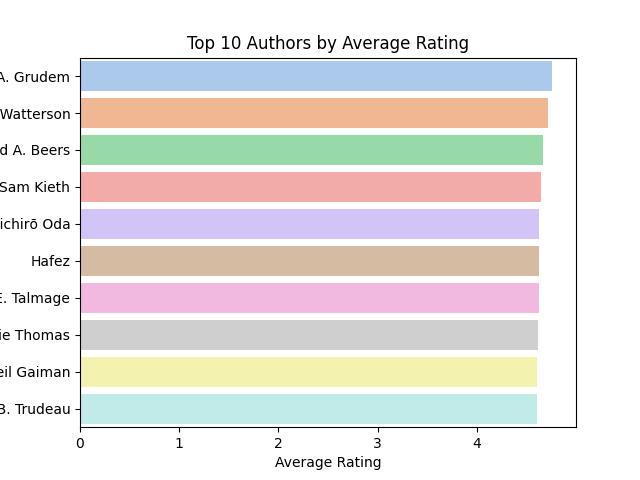
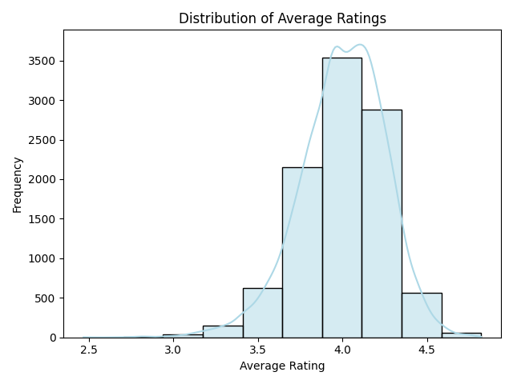
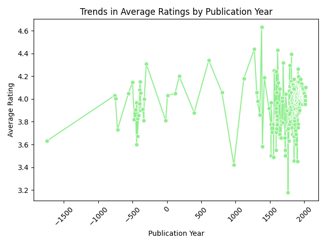
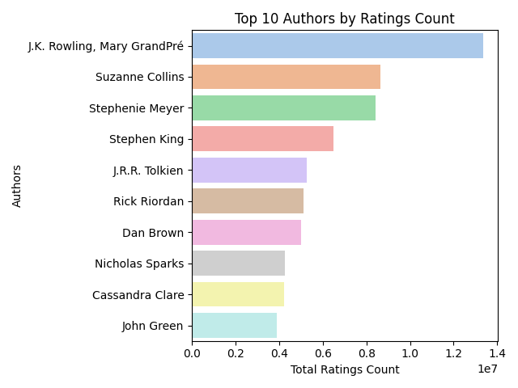

# Goodreads Books Dataset

This dataset contains information about books available on Goodreads, including attributes like titles, authors, ratings, and publication details, which helps measure book popularity and user engagement.

## Dataset Summary

- **Dataset Size:** (10000, 23)
- **Column Names:**
  ```plaintext
  Index(['book_id', 'goodreads_book_id', 'best_book_id', 'work_id',
  'books_count', 'isbn', 'isbn13', 'authors', 'original_publication_year',
  'original_title', 'title', 'language_code', 'average_rating',
  'ratings_count', 'work_ratings_count', 'work_text_reviews_count',
  'ratings_1', 'ratings_2', 'ratings_3', 'ratings_4', 'ratings_5',
  'image_url', 'small_image_url'],
  dtype='object')
  ```

### Numerical Summary Statistics

| Statistic       | book_id      | goodreads_book_id | best_book_id | work_id     | books_count | ratings_1   | ratings_2   | ratings_3   | ratings_4   | ratings_5   |
|------------------|--------------|--------------------|--------------|-------------|-------------|--------------|--------------|--------------|--------------|--------------|
| count            | 10000.00000  | 1.000000e+04       | 1.000000e+04 | 1.000000e+04 | 10000.00000 | 10000.00000  | 10000.00000  | 10000.00000  | 1.000000e+04 | 1.000000e+04 |
| mean             | 5000.50000   | 5.264697e+06       | 5.471214e+06 | 8.646183e+06 | 75.712700   | 1345.040600  | 3110.885000  | 11475.893800 | 1.996570e+04 | 2.378981e+04 |
| std              | 2886.89568   | 7.575462e+06       | 7.827330e+06 | 1.175106e+07 | 170.470728  | 6635.626263  | 9717.123578  | 28546.449183 | 5.144736e+04 | 7.976889e+04 |
| min              | 1.00000      | 1.000000e+00       | 1.000000e+00 | 8.700000e+01 | 1.000000    | 11.000000    | 30.000000    | 323.000000   | 7.500000e+02 | 7.540000e+02 |
| 25%              | 2500.75000   | 4.627575e+04       | 4.791175e+04 | 1.008841e+06 | 23.000000   | 196.000000   | 656.000000   | 3112.000000  | 5.405750e+03 | 5.334000e+03 |
| 50%              | 5000.50000   | 3.949655e+05       | 4.251235e+05 | 2.719524e+06 | 40.000000   | 391.000000   | 1163.000000  | 4894.000000  | 8.269500e+03 | 8.836000e+03 |
| 75%              | 7500.25000   | 9.382225e+06       | 9.636112e+06 | 1.451775e+07 | 67.000000   | 885.000000   | 2353.250000  | 9287.000000  | 1.602350e+04 | 1.730450e+04 |
| max              | 10000.00000  | 3.328864e+07       | 3.553423e+07 | 5.639960e+07 | 3455.000000  | 456191.000000 | 436802.000000 | 793319.000000 | 1.481305e+06 | 3.011543e+06 |

### EDA
- **Numerical Heatmap Analysis**
  - Insights: This heatmap provides a fascinating glimpse into the interrelationships among various numerical columns. Of particular interest is the strong correlation (0.97) between 'goodreads_book_id' and 'best_book_id', indicating that these two columns might be measuring similar aspects. Additionally, the moderate correlation (0.69) between 'best_book_id' and 'work_id' suggests a meaningful connection worth exploring further. 'Books_count' shows a weaker relationship with other variables, hinting that the total count of books may not be as influential.

## Key Analysis
1. **Top N Authors by Average Rating**
   - 
   - Finding: A. Grudem shines at the top with an impressive average rating, followed by notable authors like R. Watterson and A. Beers. 

2. **Distribution of Average Ratings**
   - 
   - Finding: The average ratings cluster around the 4.0 mark, indicating that the majority of books are generally well-received, with intriguing outliers on both ends. 

3. **Trends in Publication Years**
   - 
   - Finding: Average book ratings show fluctuations over time, with a noticeable upward trend in the later years, particularly after 1500.

4. **Authors with the Highest Ratings Count**
   - 
   - Finding: J.K. Rowling stands atop the ratings count, followed by other popular authors, reflecting their immense influence and diverse reader demographics.

In summary, the Goodreads Books Dataset reveals significant insights into book popularity, author impact, and reader preferences through various analyses, showcasing the evolution of literature and its reception over time.