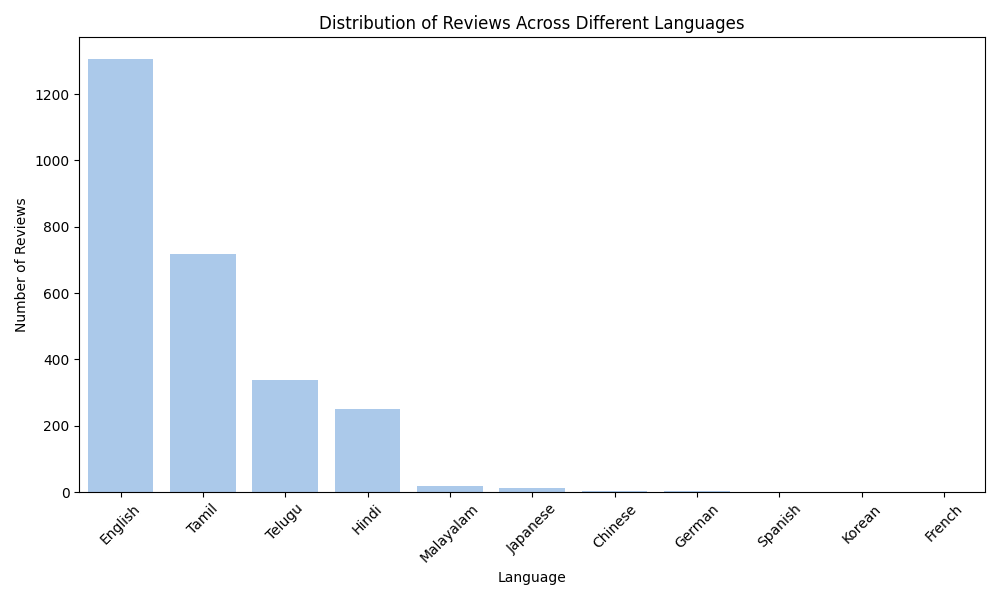
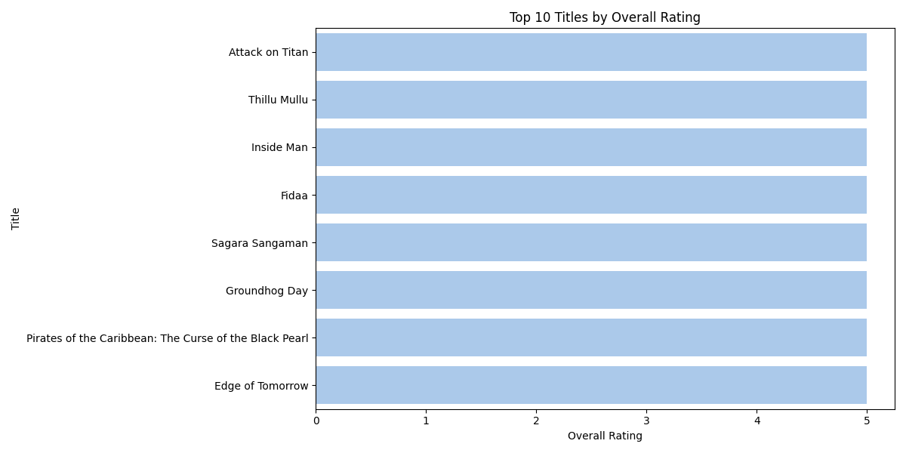
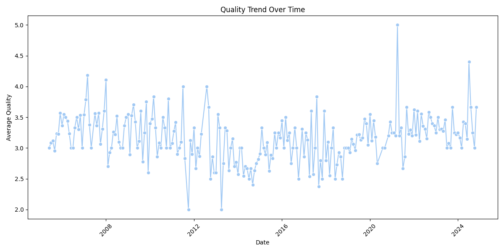
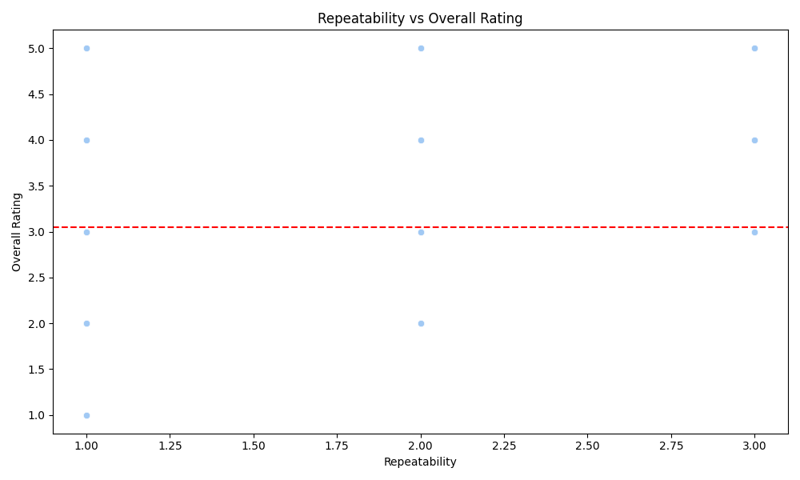

# Movie Ratings Dataset

This dataset appears to document various aspects of movies, including their release dates, languages, titles, creators, and ratings across different criteria.

## Dataset Summary
- **Dataset Size**: (2652, 8)
- **Column Names**: 
  - Index(['date', 'language', 'type', 'title', 'by', 'overall', 'quality', 'repeatability'], dtype='object')

### Numerical Summary Statistics
| Statistic | Overall | Quality | Repeatability |
|-----------|---------|---------|---------------|
| Count     | 2652.00 | 2652.00 | 2652.00       |
| Mean      | 3.05    | 3.21    | 1.49          |
| Std Dev   | 0.76    | 0.80    | 0.60          |
| Min       | 1.00    | 1.00    | 1.00          |
| 25%       | 3.00    | 3.00    | 1.00          |
| 50%       | 3.00    | 3.00    | 1.00          |
| 75%       | 3.00    | 4.00    | 2.00          |
| Max       | 5.00    | 5.00    | 3.00          |

### EDA
- **Numerical Heatmap Analysis**:  
  This vibrant heatmap showcases the relationships among three key numerical variables: 'overall', 'quality', and 'repeatability'. The strong correlation between 'overall' and 'quality' (0.93) suggests that enhancements in quality significantly bolster overall performance. Meanwhile, 'quality' and 'repeatability' have a moderate correlation (0.81), indicating that consistent quality can lead to greater reliability in results. Interestingly, 'overall' and 'repeatability' show a lower correlation (0.51), suggesting that while a high overall score can contribute to repeatability, other factors may play a crucial role. The varying shades of color provide a visual guide to these relationships, making it easy to discern where improvements can be targeted for optimal performance.

## Key Analysis
1. **Language Distribution Analysis**
     
   - The chart presents a fascinating landscape of review distribution across various languages, showcasing a clear dominance of English, with over 1,200 reviews. Tamil follows as a notable contender, boasting around 600 reviews. This distribution highlights linguistic preferences among reviewers and may suggest that English-speaking audiences are leading the conversation.

2. **Top N Titles by Overall Rating**
     
   - Diving into the rankings, we see an impressive lineup of titles, with 'Attack on Titan' boasting the highest overall rating. Other notable mentions include 'Thillu Mullu', 'Inside Man', and classic hits like 'Groundhog Day', showcasing diverse tastes among film enthusiasts.

3. **Date-Based Quality Trend Analysis**
     
   - The average quality scores oscillate from 2008 to 2024, with a remarkable spike around 2020, hinting at a significant event that positively influenced quality. The overall trend indicates enhancements in processes or standards over the years.

4. **Repeatability vs Overall Rating Correlation**
     
   - The chart paints a compelling picture: while overall ratings hover around a consistent average, repeatability fluctuates without a clear trend. This hints at a nuanced relationship between consumer experience consistency and perceived quality.

---

In summary, the Movie Ratings Dataset provides a comprehensive overview of how movies are rated across various dimensions, highlighting key trends in language usage, title popularity, quality over time, and the relationship between repeatability and overall ratings. The insights drawn from this dataset can inform future analyses and strategies in the film industry.